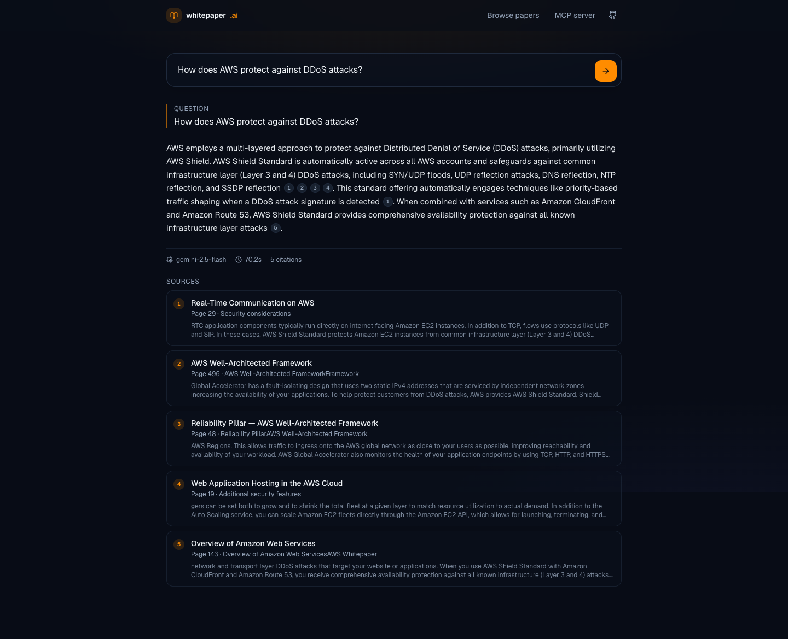
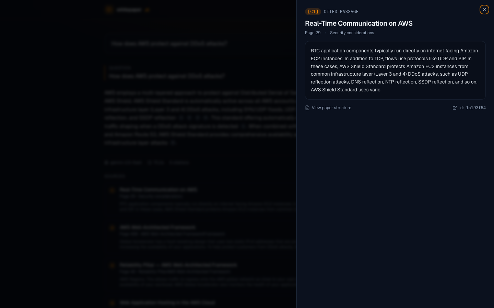
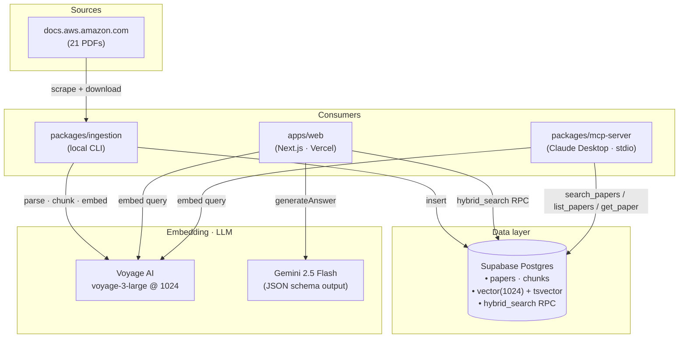
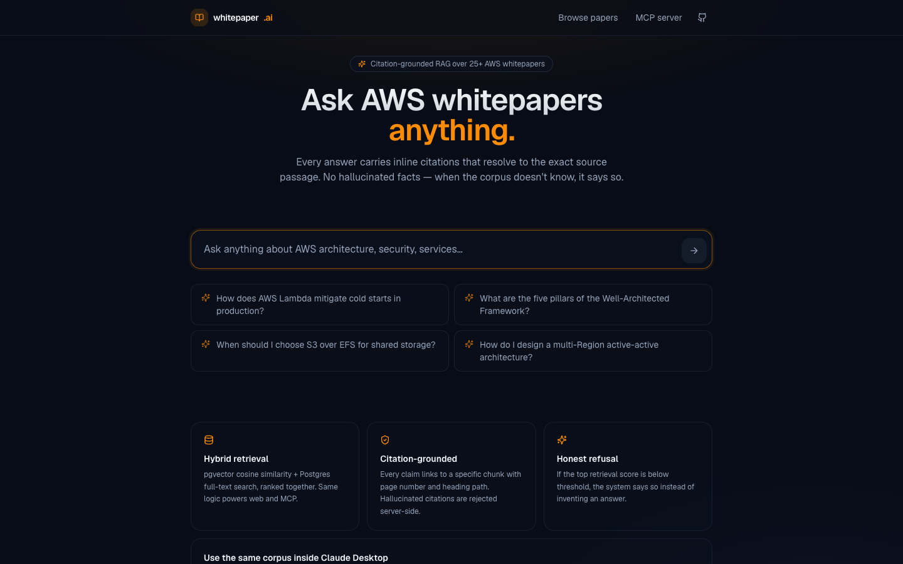
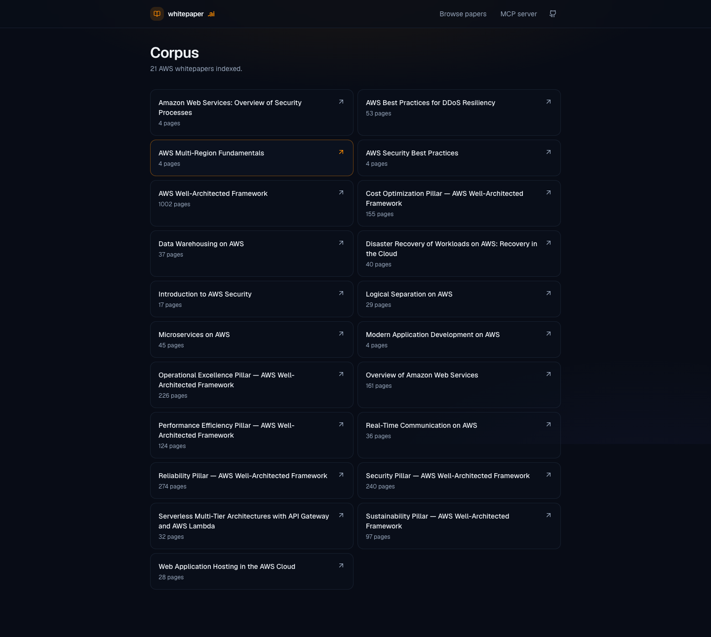
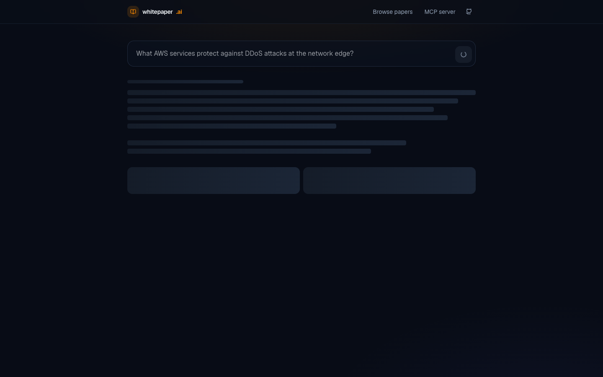
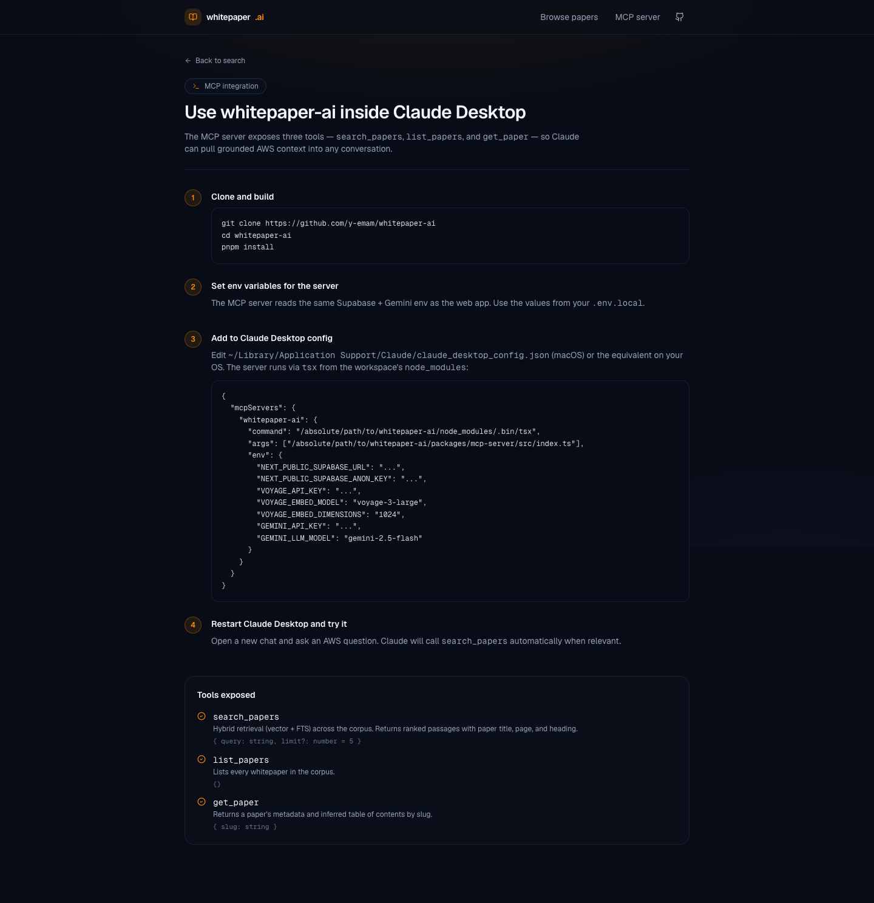

# whitepaper-ai

> Citation-grounded RAG search across 39 AWS whitepapers, with a polished Next.js web UI and a Claude-Desktop-compatible MCP server. Same hybrid retrieval (pgvector + Postgres FTS) powers both.

**Live demo:** [whitepaper-ai.vercel.app](https://whitepaper-ai.vercel.app)

[]() []() []() []() []() []()

---



Every claim in the answer is an inline `[c#]` badge. Click one and the exact source passage opens in a drawer — paper title, page, section heading, and the literal excerpt that grounded the claim:



---

## Why this exists

AWS publishes 150+ whitepapers covering compute, storage, networking, security, and architecture. The information is authoritative but the format is hostile to fast research — PDFs aren't cross-searchable, concepts span multiple papers, and engineers either skim 80 pages or trust ungrounded chat answers.

`whitepaper-ai` makes the corpus queryable in natural language with:

- **Hybrid retrieval** — pgvector cosine similarity + Postgres full-text search, ranked together in a single SQL RPC.
- **Citation-grounded generation** — Gemini 2.5 Flash answers under a strict JSON schema; every cited label is verified server-side against the retrieved set before responding. Hallucinated citations get rejected and retried.
- **Honest refusal** — if the top retrieval score falls below the configured floor, the system says *"the corpus does not contain enough information"* instead of inventing an answer.
- **One retrieval impl, three consumers** — the ingestion script, the Next.js web app, and the MCP server all call the same `retrieve()` from `packages/shared`.

## Architecture



All three consumers share `packages/shared` — one `retrieve()`, one prompt builder, one citation validator.

## Screenshots

| Home | Browse corpus |
|---|---|
|  |  |

| Loading skeleton | MCP setup guide |
|---|---|
|  |  |

## Quickstart

```bash
# 1. Install
pnpm install

# 2. Configure
cp .env.example .env.local
# fill in Supabase + Voyage + Gemini keys

# 3. Apply the schema (uses supabase CLI, links to your project)
supabase link --project-ref <your-project-ref>
supabase db push

# 4. Validate corpus URLs (writes packages/ingestion/data/corpus.json)
pnpm ingest:scrape

# 5. Download, chunk, embed, insert
pnpm ingest

# 6. Run the web app
pnpm dev
# open http://localhost:3000
```

## Monorepo layout

```
apps/web/                    Next.js 14 App Router web app
packages/shared/             retrieval, embed, llm, supabase, types — one impl, three consumers
packages/mcp-server/         MCP stdio server for Claude Desktop
packages/ingestion/          local script: scrape → download → chunk → embed → insert
supabase/migrations/         schema migrations applied via `supabase db push`
docs/                        PDD, TDD, GOAL, screenshots
```

## Tech stack

| Layer | Choice | Why |
|---|---|---|
| Frontend | Next.js 14 App Router · TypeScript strict | Mature, edge-ready, type-safe. |
| Styling | Tailwind + shadcn-style primitives + framer-motion | Fast iteration, clean dark theme. |
| Database | Supabase Postgres + pgvector | Vector + relational + free tier. |
| Embeddings | Voyage AI `voyage-3-large` @ 1024 dims | Anthropic-recommended; 200M free tokens/month covers ingestion + queries. |
| LLM | Gemini 2.5 Flash | Cheap, fast, structured-output via JSON schema. |
| PDF parsing | `pdf-parse` | Per-page text extraction. |
| MCP | `@modelcontextprotocol/sdk` (stdio) | Standard MCP TypeScript SDK. |
| Hosting | Vercel (web) · local (MCP server + ingestion) | Free tier, zero infra. |
| Monorepo | pnpm workspaces | Single install, shared types. |

## Setting up the MCP server in Claude Desktop

```bash
pnpm install
```

Edit `~/Library/Application Support/Claude/claude_desktop_config.json` (macOS):

```json
{
  "mcpServers": {
    "whitepaper-ai": {
      "command": "/absolute/path/to/whitepaper-ai/node_modules/.bin/tsx",
      "args": [
        "/absolute/path/to/whitepaper-ai/packages/mcp-server/src/index.ts"
      ],
      "env": {
        "NEXT_PUBLIC_SUPABASE_URL": "...",
        "NEXT_PUBLIC_SUPABASE_ANON_KEY": "...",
        "VOYAGE_API_KEY": "...",
        "VOYAGE_EMBED_MODEL": "voyage-3-large",
        "VOYAGE_EMBED_DIMENSIONS": "1024",
        "GEMINI_API_KEY": "...",
        "GEMINI_LLM_MODEL": "gemini-2.5-flash"
      }
    }
  }
}
```

Quit and reopen Claude Desktop. Try *"Search whitepaper-ai for AWS Lambda cold-start mitigation strategies."* — Claude will call `search_papers` automatically.

The MCP server exposes three tools:

- **`search_papers(query, limit?)`** — hybrid retrieval across the corpus
- **`list_papers()`** — every paper in the corpus
- **`get_paper(slug)`** — paper metadata + inferred table of contents

## Environment variables

| Var | Required | Purpose |
|---|---|---|
| `NEXT_PUBLIC_SUPABASE_URL` | yes | Supabase project URL |
| `NEXT_PUBLIC_SUPABASE_ANON_KEY` | yes | Anon key for read access |
| `SUPABASE_SERVICE_ROLE_KEY` | ingestion + analytics | Service-role key (server-side only) |
| `VOYAGE_API_KEY` | yes | https://dashboard.voyageai.com |
| `VOYAGE_EMBED_MODEL` | no | default `voyage-3-large` |
| `VOYAGE_EMBED_DIMENSIONS` | no | default `1024` |
| `GEMINI_API_KEY` | yes | https://aistudio.google.com/apikey |
| `GEMINI_LLM_MODEL` | no | default `gemini-2.5-flash` |
| `RETRIEVAL_TOP_K` | no | default 8 |
| `RETRIEVAL_VECTOR_WEIGHT` | no | default 0.6 |
| `RETRIEVAL_FTS_WEIGHT` | no | default 0.4 |
| `RETRIEVAL_REFUSAL_THRESHOLD` | no | default 0.4 |
| `INGEST_CONCURRENCY` | no | default 1 |

## Scripts

```bash
pnpm dev               # next dev for apps/web
pnpm build             # build all workspaces
pnpm typecheck         # tsc --noEmit across all workspaces
pnpm test              # vitest in packages/shared (chunker, citation extractor, refusal)
pnpm ingest:scrape     # validate seed URLs → packages/ingestion/data/corpus.json
pnpm ingest            # download + parse + chunk + embed + insert
pnpm mcp               # start the MCP server (stdio)
pnpm mcp:build         # build the MCP server to dist/
```

## Quality bar

- TypeScript **strict** mode across 4 workspaces — no `any`, no `@ts-ignore`.
- Zod validation at every API boundary.
- Citation labels verified server-side; hallucinated citations cause one retry then a hard failure.
- All UI states (loading, error, empty, refusal) explicitly designed.
- 16 unit tests covering the chunker, citation extractor, and refusal threshold.
- Mobile responsive (390 px viewport tested).
- Vercel Analytics + Speed Insights wired in.

## Design docs

Full product and technical design lives in [docs/PDD.md](./docs/PDD.md) and [docs/TDD.md](./docs/TDD.md).

## Future work

- Per-paper search filter in the UI
- Conversation follow-ups (history is wired in the schema, not the UI yet)
- Cross-encoder reranker over the top-30 hybrid set
- OCR fallback for image-only PDFs

## License

MIT
